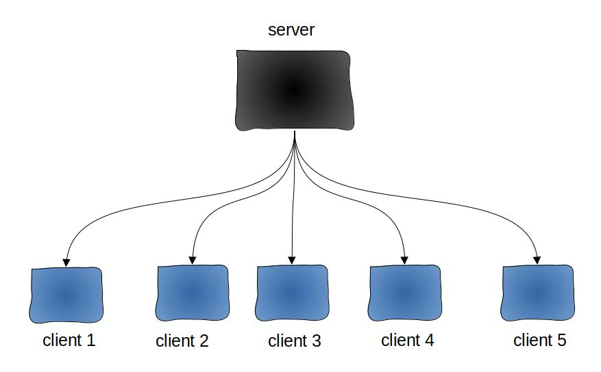
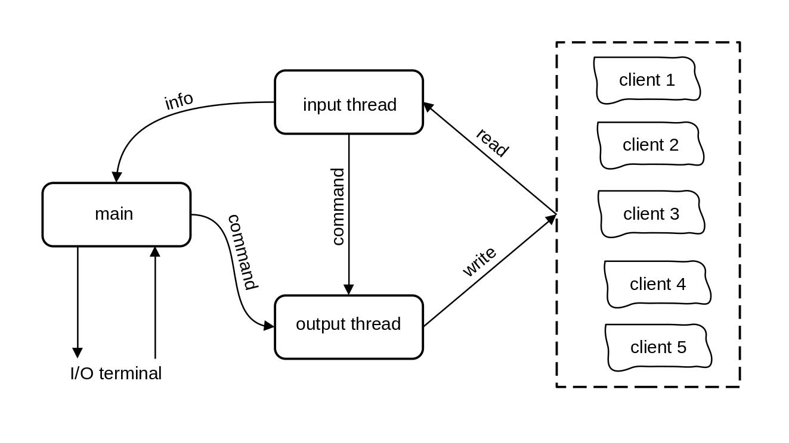

<h1>Simple Network</h1>

<h3>Общие сведения</h3>
Данный пакет программ позволяет эмулировать простейшую сеть на локальной машине. Сеть представляет из себя сервер и пять клиентов, которыми сервер управляет по сети при помощи протокола UDP. Структура данной сети:

Архитектура данного ПО основана на использовании трех потоков внутри сервера, каждый из которых выполняет свои функции:

- main (главный поток) отвечает за загрузку, выключение сервера, за взаимодействие с пользователем через стандартный поток ввода-вывода (по умолчанию терминал), а также за получение информации от входящего потока и выдачу команд на выходящий поток
- input thread (входящий поток) предназначен для считывания и обработки информации, получаемой от клиентов, а также для передачи части информации в главный поток и выдачи команд на выходящий поток
- output thread (выходящий поток) передает команды от входного или главного потоков непосредственно адресуемому клиенту

Архитектура ПО:

Клиенты находятся в одном из следующих состояний (или их комбинации): <a name="States"></a>
- OFF (индикация отсутствует)
- RED (красный)
- YELLOW (желтый)
- GREEN (зеленый)
- ALL (присутствует вся индикация)

Таким образом, клиент из себя представляет светофор, которым удаленно управляет сервер.

<h3>Требования</h3>

- один из дистрибутивов семейства Debian
- GLIBC 2.31 или новее
- GCC 10.2.1 или новее
- GNU Make 4.3 или новее

<h3>Скачивание и сборка</h3>
Необходимо скачать последний доступный <a href="https://github.com/VasiliyMatlab/SimpleNetwork/releases">релиз</a> себе на диск, затем разархивировать его:

- если архив расширения `.zip`, то выполнить следующую инструкцию:
```bash
unzip SimpleNetwork-N.N.zip
```
- если архив расширения `.tar.gz`, то выполнить следующую команду:
```bash
tar xvf SimpleNetwork-N.N.tar.gz
```
Следующим шагом является сборка проекта с помощью утилиты `make`:
```bash
cd SimpleNetwork-N.N/src/
make
cd ../bin/
ls
```
После выполнения указанных действий в списке содержимого папки `bin/` должны появиться файлы `server` и `client`. Если данные файлы в результате выполнения указанных действий, не были созданы - обратитесь к автору данной программы

<h3>Использование</h3>
Прежде всего запускаем сервер:

```bash
./server
```
Затем в новом окне терминала запускаем клиент:

```bash
./client M
```
Здесь и далее: M - любое число от 1 включительно до 5 включительно

Если все выполнено верно, то клиент подключиться к серверу и оба скажут об этом. После этого можно подключить остальных четырех клиентов (можно и меньше).
Управление сетью осуществляется с помощью следующих команд, вводимых в терминале сервера (M заменяем на номер соответствующего клиента):
- "Is client #M is on?" - проверка подключения клиента M к серверу
- "Get client #M current state" - проверка текущего состояния клиента M
- "Set client #M state: STATE" - перевод клиента M в состояние [STATE](#States)
- "Shutdown client #M - отсоединение клиента M от сервера (клиент автоматически выключается)
- "Shutdown server" - выключение сервера (перед этим все клиенты в принудительном порядке выключаются)

При возникновении различных ошибок или обнаружении багов, просьба обратиться к автору ПО с детальным описанием проблемы и ходом действий, которые привели к текущей ситуации

<h3>ToDo List</h3>

- организовать управление не пятью клиентами, а произвольным количеством (в разумных пределах); установка потолка осуществляется либо при запуске сервера вторым аргументом, либо по команде, данной серверу
- реализовать команду по выдаче состояний всех подключенных клиентов
- реализовать команду по переводу всех подключенных клиентов в определенное состояние
- реализовать команду по выключению всех подключенных клиентов
- реализовать команду по выводу на экран списка всех подключенных клиентов
- реализовать команду, при получении которой сервер перестает подключать к себе новых клиентов; а также команду, которая такой блок снимает
- сделать вывод состояния клиента цветным (RED - разукрасить красным цветом и т.д.)

***
<p align="center"><a href="https://github.com/VasiliyMatlab"></a></p>
<p align="center"><a href="https://github.com/VasiliyMatlab" style="color: #000000">VasiliyMatlab</a></p>
